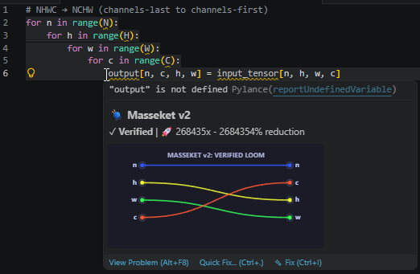
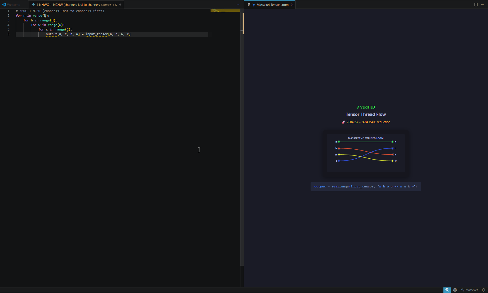

🧶 Masseket v2
> **Visual loop compiler & verifier with decidable equality**
>
> Turn slow, nested Python tensor loops into verified, vectorized `einops` code — with a live thread loom diagram.


---
✨ What it does
Write a slow, readable loop:
```python
for n in range(N):
    for h in range(H):
        for w in range(W):
            for c in range(C):
                output[n, c, h, w] = input_tensor[n, h, w, c]
```
Hover → instant compact thread diagram  
Click 💡 → collapses to one line:
```python
output = rearrange(input_tensor, 'n h w c -> n c h w')
```
Open panel → full-size loom with verified badge & generated code
---
🚀 Features
Feature	How it works
Hover Tooltip	Mouse over any tensor loop → compact SVG thread flow, verified status, speedup estimate
Code Action	💡 lightbulb → "Replace loop with vectorized einops" — one-click refactor
Full Loom Panel	Status bar $(sparkle) or `Ctrl+Shift+P` → `Masseket: Visualize Tensor Loop`
Verified Badge	Green ✓ if loop maps to valid einops; red ⚠️ if shape mismatch
Diagnostics	Save file → red/yellow squiggles under invalid loops
NHWC → NCHW	Channels-last to channels-first in one click
Any permutation	h w c → w h c, b (h w) c → b h w c, etc.
---
📸 Demo
Hover — instant preview

Full panel — deep inspection

---
🛠️ Installation
From VSIX (local)
Download `masseket-v2-0.2.0.vsix` from Releases
VS Code → Extensions → `...` → Install from VSIX...
Select the `.vsix` file
From Marketplace (coming soon)
```
Search: "Masseket" in VS Code Extensions
```
---
⚙️ Requirements
VS Code `^1.85.0`
Python `3.8+` (path configurable in settings)
Configure Python path
If `python3` is not found (common on Windows), set it in VS Code settings:
```json
{
    "masseket.pythonPath": "python"
}
```
Or full path:
```json
{
    "masseket.pythonPath": "C:\Users\you\AppData\Local\Programs\Python\Python311\python.exe"
}
```
---
🧪 Test it
Create a Python file and paste:
```python
# NHWC → NCHW (channels-last to channels-first)
for n in range(N):
    for h in range(H):
        for w in range(W):
            for c in range(C):
                output[n, c, h, w] = input_tensor[n, h, w, c]
```
Hover over the loop → see thread diagram
Click 💡 → replace with `rearrange(...)`
Save → diagnostics check validity
---
🏗️ Architecture
```
┌─────────────────┐     spawn     ┌─────────────────────────────┐
│  VS Code (TS)   │ ◄───────────► │  Python Backend (AST)     │
│                 │    JSON-RPC   │  • Loop parser (ast)      │
│  • Hover        │               │  • SVG generator            │
│  • Code actions │               │  • Einops codegen           │
│  • Diagnostics  │               │  • Decidable verifier     │
│  • Webview panel│               │                             │
└─────────────────┘               └─────────────────────────────┘
```
No models. No GPU. Pure symbolic math.
---
📦 Build from source
```bash
git clone https://github.com/MrSavage009/masseket-v2.git
cd masseket-v2
npm install
npm run compile
# F5 in VS Code to debug
vsce package    # builds .vsix
```
---
🧠 The math
Masseket v2 uses a decidable structural equality solver:
Parse loop AST → extract index mappings
Represent as finite read-map on tensor positions
Reduce to canonical normal form
Compare: if match → verified ✓
This guarantees the generated `einops` code is mathematically identical to your loop.
---
🗺️ Roadmap
[x] Hover tooltip with compact SVG
[x] Full webview panel
[x] Code action (lightbulb refactor)
[x] Diagnostics on save
[ ] Split/merge axes (`(h w)` notation)
[ ] Reduction loops (`sum`, `mean`, `max`)
[ ] `einsum` codegen
[ ] GitHub Copilot shield (verify AI suggestions)
[ ] PyPI package for Jupyter/Colab
---
🤝 Contributing
PRs welcome. Open an issue for bugs or feature requests.
---
📄 License
MIT © 2026 MrSavage009
---
> *"Masseket" (מַסֶּכֶת) — Biblical Hebrew for "warp/web of a loom." Tensor dimensions as woven threads.*